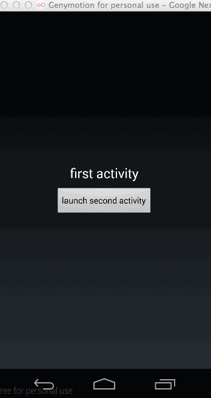

SwipeActivity
=============

Swipe to finish activity. Because it quite difficult for large screen device to reach the back button on the left top corner, 
i create this project to make activity be closed when user swipe for a distance. You can find this effect on My favourite app [smzdm](https://play.google.com/store/apps/details?id=com.smzdm.client.android).

Usage
=============
You only need to make your activity to be the child of `SwipeActivity`.
  
    public class SecondActivity extends SwipeActivity {
        @Override
        protected void onCreate(Bundle savedInstanceState) {
            super.onCreate(savedInstanceState);
            setContentView(R.layout.activity_main);
        }
    }
Customization
=============

Be default, SwipeActivity extends stock `Activity`. if you want to use `SherlockActivity` or `ActionBarActivity`, you just need to change the parent of `SwipeActivity`, then it's good to go.
